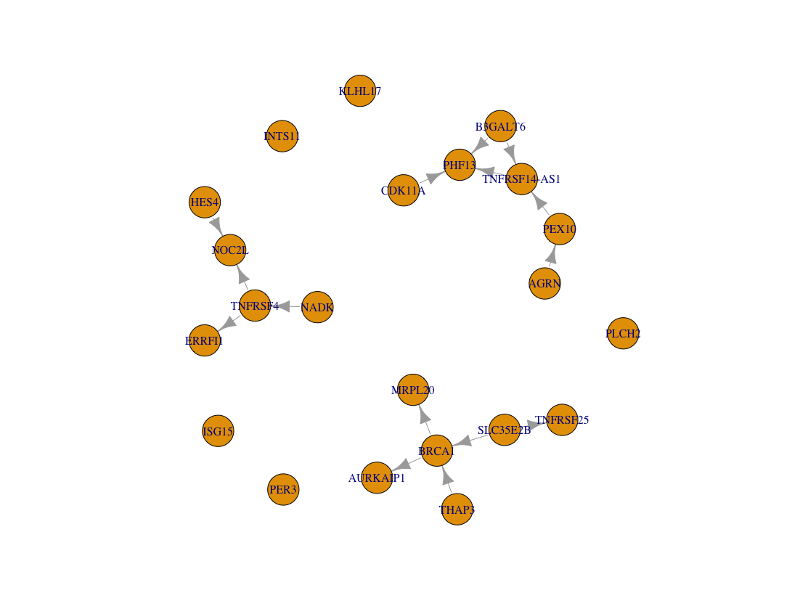
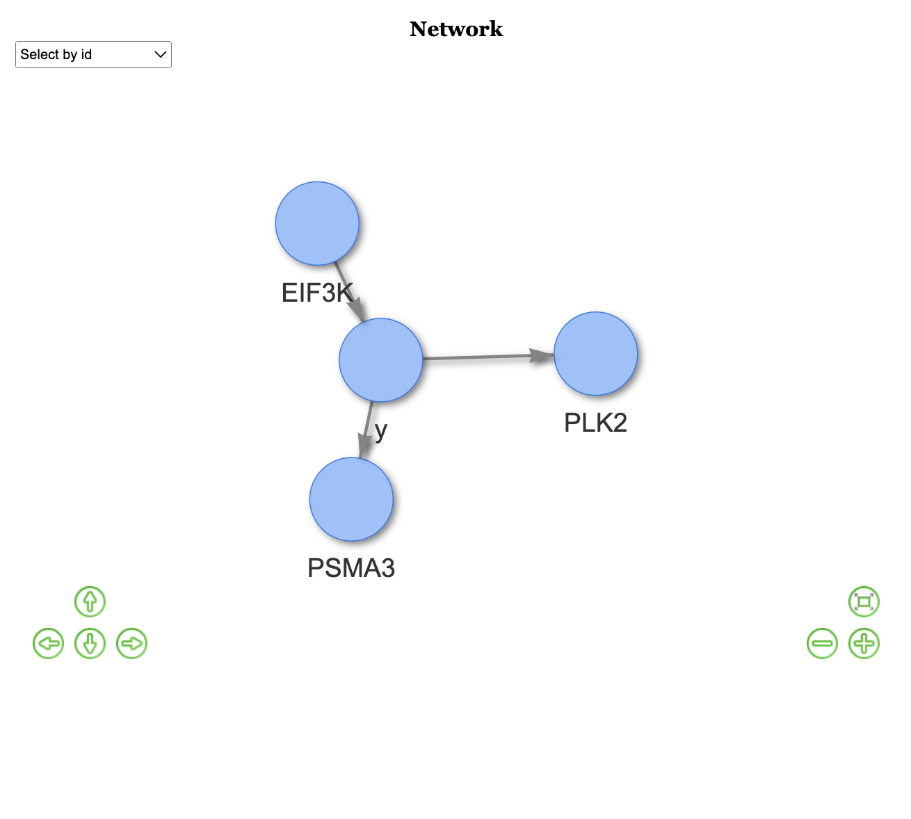

# BRCA Gene Expression Analysis with DAG-based Causal Inference

## Overview
This project focuses on analyzing BRCA gene expression data to explore causal relationships using Directed Acyclic Graphs (DAG). The analysis leverages various statistical and machine learning techniques to identify gene regulatory mechanisms involved in breast cancer progression. High-resolution visualizations, including heatmaps, are generated to highlight significant gene interactions.

## Project Structure
```
📦brca
 ┣ 📂data
 ┃ ┣ 📜BRCA_expression_data.csv
 ┃ ┗ 📜metadata.csv
 ┣ 📂scripts
 ┃ ┣ 📜heatmap.R          
 ┃ ┗ 📜utils.R            
 ┃ ┗ 📜MXM_analysis.R
 ┣ 📂results
 ┃ ┣ 📜heatmap.png
 ┃ ┗ 📜DAC_from_dagbagm.png
 ┃ ┗ 📜DAGBAGm_for_y.png   
 ┃ ┗ 📜mxm_50_variables_for_y.png
 ┣ 📜README.md
 ┗ 📜requirements.txt
```

## Analysis Workflow
1. **Data Preprocessing**
   - Load and clean BRCA expression data.
   - Integrate clinical metadata for enriched analysis.

2. **DAG-based Causal Inference**
   - Apply `bnlearn` and `dagitty` for structural learning.
   - Conduct conditional independence testing and pathway analysis.

3. **Visualization**
   - Generate heatmaps to visualize expression patterns.
   - Plot DAG structures to represent causal relationships.

4. **Interpretation**
   - Identify key gene regulators involved in cancer pathways.
   - Validate causal claims with sensitivity analysis.

## Technologies Used
- R (version 4.x)
- bnlearn
- dagitty
- Seurat
- ggplot2

## Results and Visualizations
  
  

## How to Run
```bash
# Clone the repository
git clone https://github.com/chenye1997/brca.git
cd brca

# Install required packages
Rscript install_packages.R

# Run the analysis
Rscript scripts/YeChen2.R
```

## Contact
- **Name:** Chen Ye
- **Email:** cxy364@miami.edu

